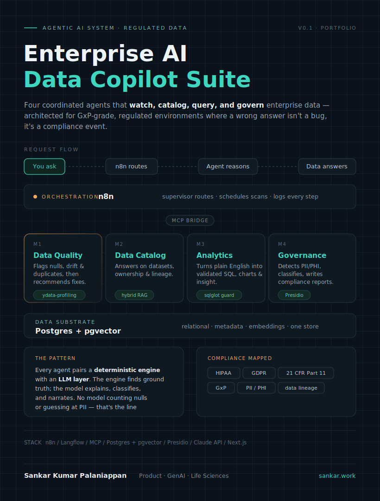

# Enterprise AI Data Copilot Suite

An agentic AI platform that helps organizations **understand, govern, and analyze enterprise data through natural language.** It combines AI-powered data quality assessment, metadata discovery, natural-language-to-SQL analytics, and governance/compliance scanning into a single conversational assistant — built on a regulated-industry (pharma/GxP) dataset to demonstrate production-grade data trust, not just demo-ware.

This project is a generalized, portfolio-ready version of a GxP document-intelligence / FDA-submission-validation platform: the same problem (can we trust this data, and can we prove it to a regulator), applied to a synthetic clinical-trial dataset so the whole pipeline is inspectable end to end.

## Why this exists

Most "AI data copilot" demos ask an LLM to do everything — including things LLMs are bad at, like guaranteeing a SQL query is safe or reliably counting nulls. This suite is built around one rule: **deterministic engines own the ground truth; the LLM only explains, classifies, and narrates.** Every module pairs a real profiling/validation/detection engine with an LLM interpretation layer on top of it. That split is the difference between a toy and something that could plausibly run in a regulated environment.

## Architecture

Two layers, connected by MCP:

- **Langflow — the brains.** LangChain with a visual canvas. Each module's "intelligence" (RAG retrieval, NL→SQL generation, classification, narrative generation) lives here as a flow. Langflow 1.10 exposes any flow as an MCP tool and includes a Smart Router / Run Flow component for routing between flows.
- **n8n — the nervous system.** Orchestration: scheduled scans, source triggers, routing user queries to the right agent, human-in-the-loop approval steps, report delivery, and — critically for a regulated-industry story — a per-step audit trail. n8n 2.0 has native LangChain nodes and a supervisor AI Agent node.
- **MCP — the bridge.** Langflow exposes each module as an MCP tool; n8n (or a Langflow Smart Router, in early phases) consumes them. No brittle glue-code HTTP calls.

```
                    ┌─────────────────────────────┐
                    │        Chat UI (Next.js)     │
                    └───────────────┬─────────────┘
                                    │
                    ┌───────────────▼─────────────┐
                    │   n8n — Supervisor / Orchestration │
                    │   (routing, scheduling, audit log) │
                    └───────┬───────┬───────┬─────┘
                            │  MCP tools    │
        ┌───────────────────┼───────┼───────┼───────────────────┐
        │                   │       │       │                   │
 ┌──────▼──────┐    ┌───────▼───┐ ┌─▼─────────┐   ┌─────────────▼┐
 │ Data Quality │    │  Catalog  │ │ Analytics │   │  Governance   │
 │    Agent     │    │   Agent   │ │   Agent   │   │    Agent      │
 │ (Langflow)   │    │ (Langflow)│ │ (Langflow)│   │  (Langflow)   │
 └──────┬───────┘    └─────┬─────┘ └─────┬─────┘   └──────┬───────┘
        │ ydata-profiling/ │ pgvector +   │ sqlglot        │ Presidio
        │ Great Expectations│ metadata     │ validation     │ + NER
        │                   │ graph        │                │
        └───────────────────┴──────────────┴────────────────┘
                                    │
                    ┌───────────────▼─────────────┐
                    │  Postgres + pgvector          │
                    │  (data + metadata + vectors)  │
                    └───────────────────────────────┘
```

## The four modules

| Module | Deterministic engine (ground truth) | LLM layer (interpretation) | Orchestrated by |
|---|---|---|---|
| **Data Quality Agent** | `ydata-profiling` / Great Expectations — nulls, duplicates, type mismatches, range violations, schema drift | Turns structured violations into a plain-English issue summary + prioritized remediation suggestions | n8n scheduled trigger → pulls table → runs engine → delivers report |
| **Data Catalog Agent** | Metadata store (table/column descriptions, ownership, lineage edges) + pgvector embeddings | Hybrid RAG: vector search for semantic questions, structured graph queries for lineage questions ("what feeds table X?") | Langflow retrieval + answer flow |
| **Analytics Agent** | `sqlglot` — parses generated SQL, blocks writes, forces a `LIMIT`; executes only against a **read-only** connection | Schema-aware NL→SQL generation, then a second pass to narrate the insight from the result set | Langflow flow, chat-triggered via n8n webhook |
| **Governance Agent** | Microsoft Presidio (+ regex/NER) — scans column samples for PII/PHI | Classifies sensitivity and generates a compliance report mapped to HIPAA, GDPR, and 21 CFR Part 11 | n8n scheduled scan → aggregates findings → routes report |

## Stack

- **Orchestration:** n8n 2.0 (self-hosted, Docker)
- **Agent reasoning:** Langflow 1.10
- **Bridge:** MCP
- **Data + metadata + vectors:** Postgres + pgvector (single instance — relational data, catalog metadata, and vector store together)
- **Deterministic engines:** ydata-profiling / Great Expectations (data quality), sqlglot (SQL safety), Microsoft Presidio (PII/PHI detection)
- **LLM:** Claude API
- **Frontend:** Next.js chat UI hitting the n8n webhook
- **Infra:** Docker Compose (local-only — supports a "data never leaves the VPC" compliance story)

## Dataset

A synthetic pharma/clinical-trial dataset (subjects, sites, adverse events) deliberately seeded with:
- Data quality issues (nulls, duplicates, type mismatches, drift) — for the Data Quality Agent to find
- PII/PHI fields — for the Governance Agent to detect and classify

## Status

Early stage — architecture and roadmap defined, build not yet started. See [`blueprint/app-plan.md`](blueprint/app-plan.md) for the phased build plan.
